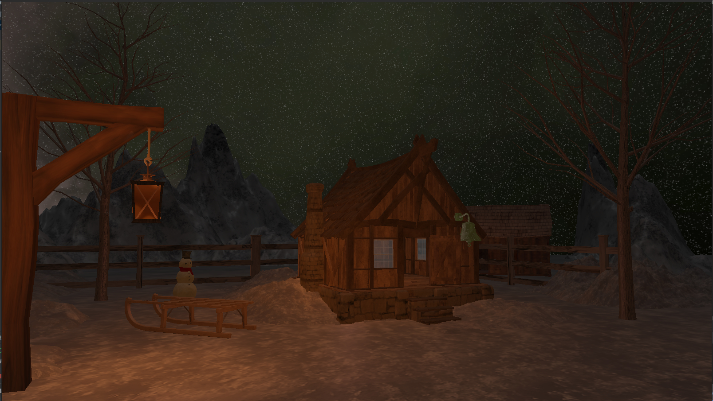
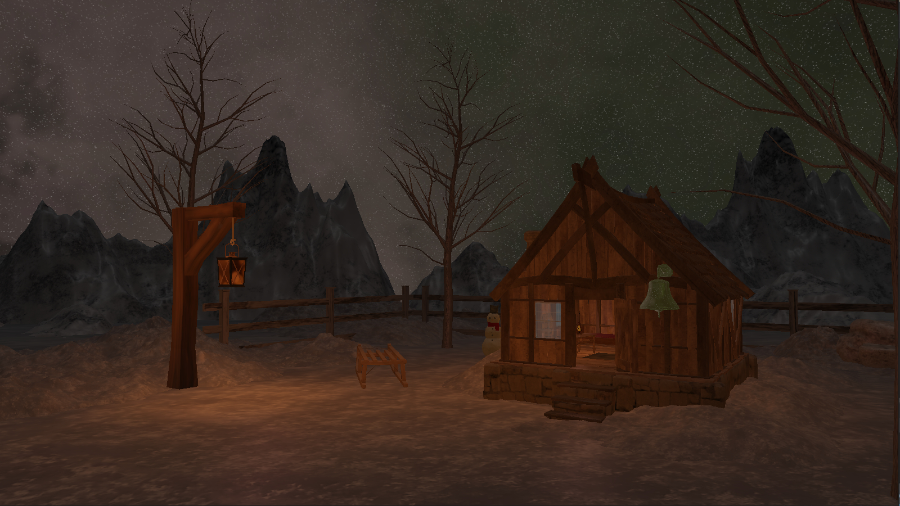
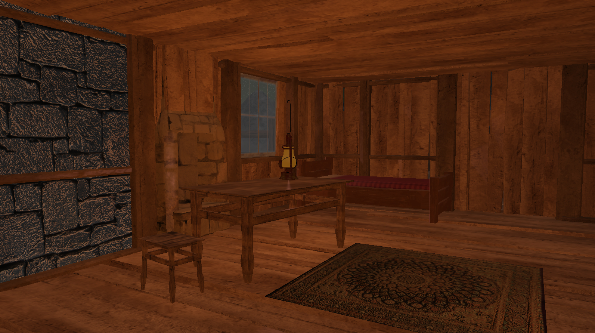
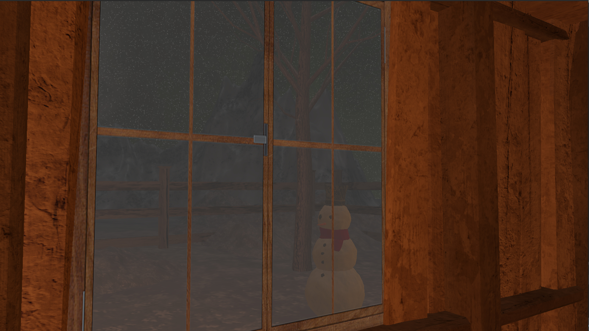
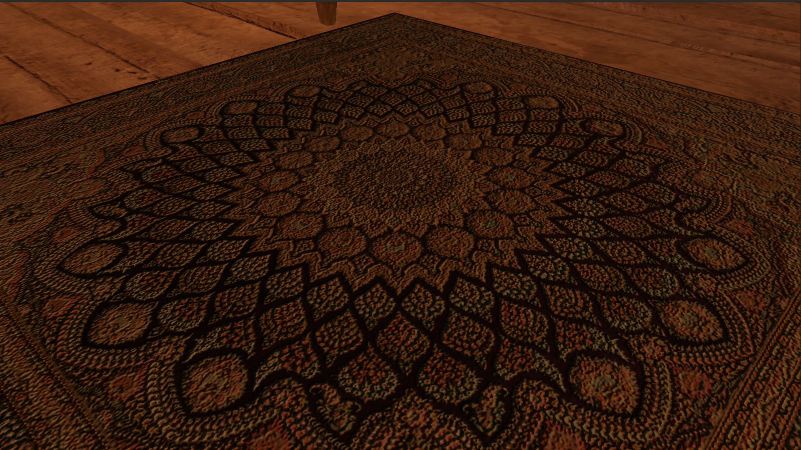
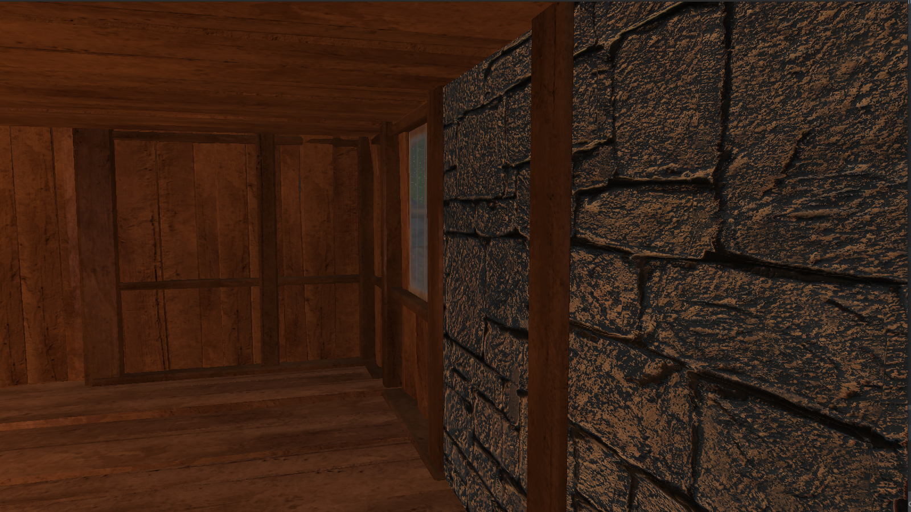
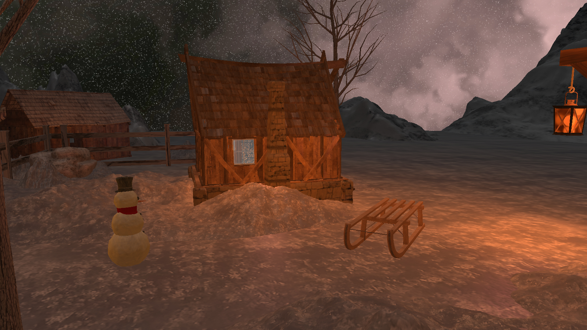
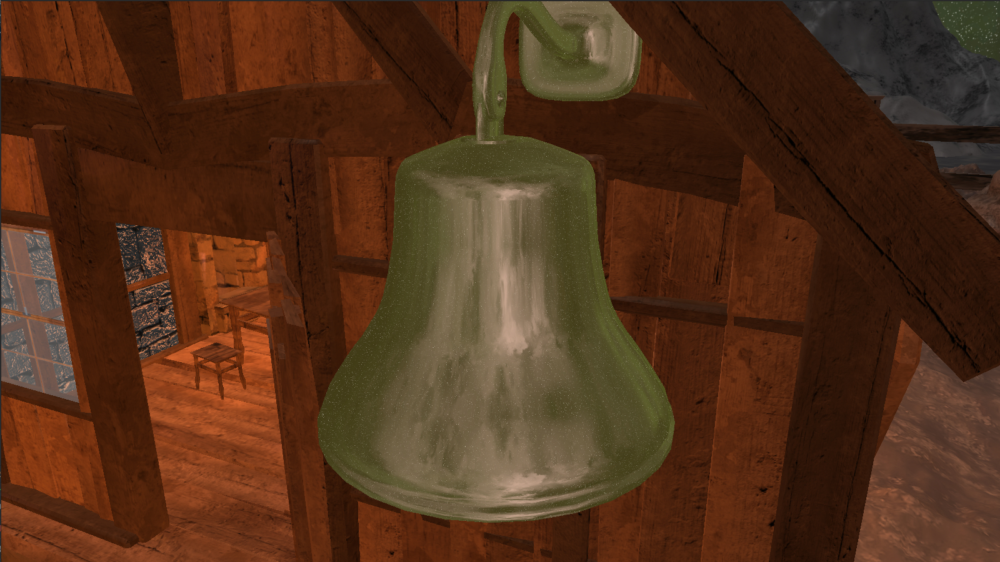
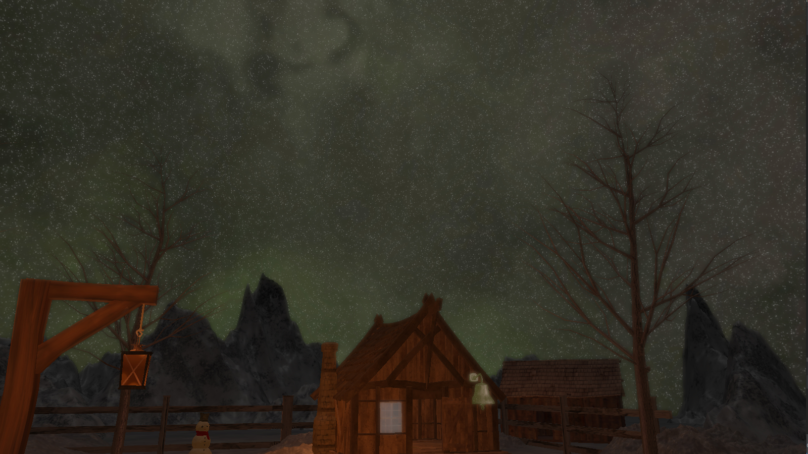

Projekat iz Računarske Grafike.

---------------------
# Komande

`F1` - on/off imgui

`G`  - on/off grayscale

`Q`  - lower heightScale for parallax mapping

`E`  - increase heightScale for parallax mapping

`J` - lower exposure

`K` - higher exposure

`H` - off/on HDR 

`B` - off/on bloom

 

---------------------

# Implementirano iz A:
* Cubemaps
* Anti Aliasing
# Implementirano iz B:
* Normal mapping
* Parallax mapping
* Bloom
* HDR

 

--------------------
# Galerija

Video - `https://drive.google.com/drive/folders/11l6OzAydZwVwiyT0pDjBbTeEcma48Y4F?usp=sharing` (video mora da se skine)

---------------------
# Uputstvo
1. Main se nalazi u src/main.cpp
2. Cpp fajlovi idu u src folder
3. Zaglavlja (h i hpp) fajlovi idu u include
4. Šejderi idu u folder shaders. `Vertex shader` ima ekstenziju `.vs`, `fragment shader` ima ekstenziju `.fs`

Skelet za projekat je `https://github.com/matf-racunarska-grafika/project_base.git `

------------------------
# Radili
* Milan Brčin, 247/19 (GitHub username: JohnMcCodeman5)
* Milica Obradović, 83/19 (GitHub username: milicaob)
